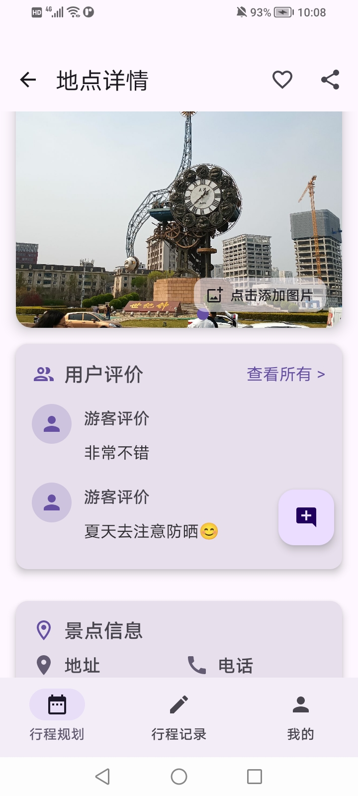
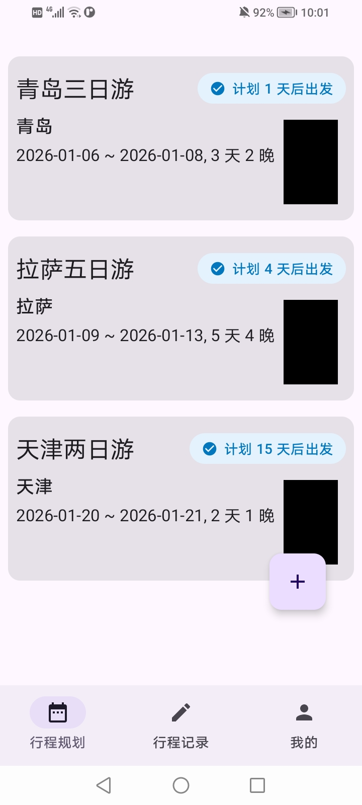
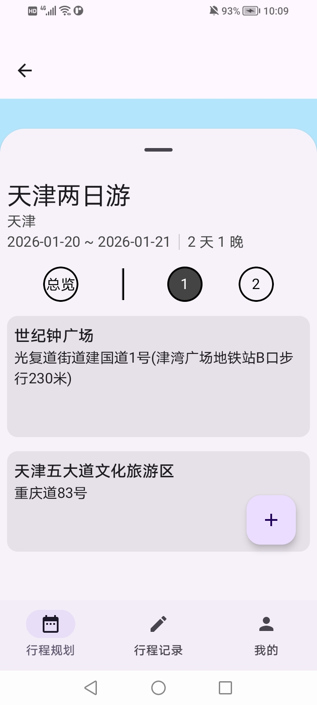
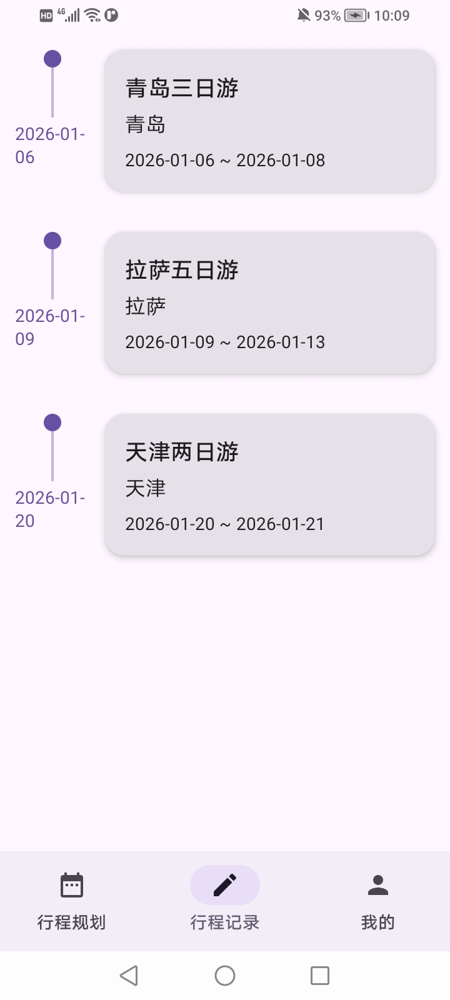
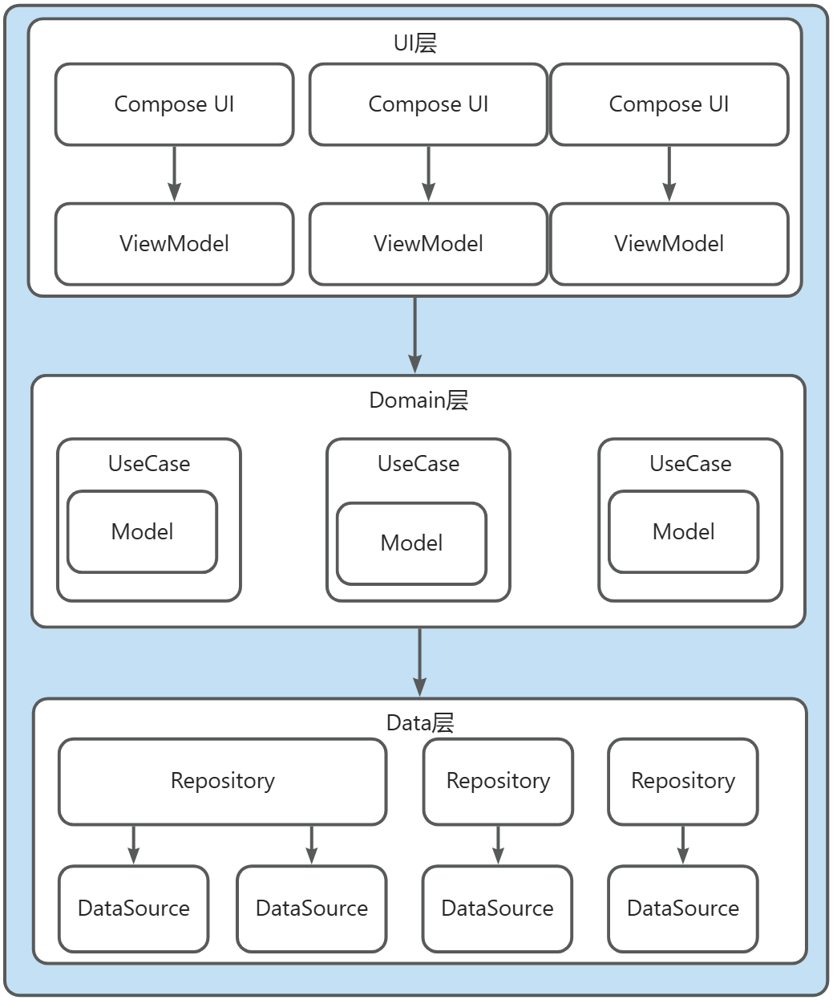

# 🌍 Trevia —— 旅行规划与记录 Android 应用

> 一款专注于 **旅行前规划** 与 **旅行中记录** 的 Android 应用，强调清晰的数据模型、可扩展的架构设计以及真实工程场景下的技术取舍。

---

## 📌 项目简介

**Trevia** 是一个面向真实使用场景设计的旅行应用，核心目标是帮助用户：

- 在出发前清晰地规划行程  
- 在旅途中高效地记录经历与回忆  
- 在长期使用中保持数据结构的可扩展性与一致性  

项目围绕 **Trip → Day → Event → Media** 的核心数据模型构建，架构清晰，注重长期演进能力。

---

## 📷 应用截图

<!-- 建议放 4 张左右，体现完整使用流程 -->
<!--

-->

  
  

  
  

---

## ✨ 核心功能

### 🧭 行程规划
- 创建 / 删除行程（Trip）
- 根据旅行日期自动生成 Day1、Day2……
- 支持对每一天进行独立编辑

### 📍 事件与地点
- 在指定日期下创建事件（Event）
- 基于高德 API 的地点搜索与 POI 提示
- 点击 POI 快速创建事件
- 支持事件的时间、地点、备注编辑

### 🖼️ 图片与媒体
- 批量导入图片  
- 协程生成缩略图  
- WorkManager 后台处理大图上传云端  
- 解析 EXIF 信息（时间 / 经纬度）  
- 自动将图片归类到对应 Event  
- 图片浏览支持翻页、缩放与拖动

### 🗺️ 地点详情页（多模块系统）
- 独立的地点详情页面，用于聚合展示地点相关信息  
- 页面由多个功能模块组成，各模块 **独立加载、独立失败、不相互阻塞**
- 已规划 / 实现的模块包括：
  - 地点基础信息
  - 天气信息
  - 图片 / 视频媒体内容
  - 用户评论与介绍内容

**架构特点：**
- 在 ViewModel 中引入显式「决策层（Decision Layer）」
- 根据以下因素动态决定页面行为：
  - 数据可用性（本地 / 远端）
  - 网络状态
  - 用户偏好等
- 主视觉内容与视频播放行为由决策层统一控制，避免 UI 层分支膨胀
- 各模块状态彼此隔离，单一模块失败不会影响整体页面可用性

### ☁️ 多端同步
- Trip / Day / Event / Photo 全量同步  
- 本地优先（Local-first）的同步策略  
- 面向冲突处理的结构化设计  

### 🔑 登录与账户管理
- 支持用户登入登出
- 支持新用户注册

---

## 🧠 架构设计

### Clean Architecture

  

项目整体采用 Clean Architecture 分层设计，每层职责清晰，保证可扩展性和可维护性，同时体现 **单向数据流、关注点分离和 Offline-First** 的设计理念：

#### 1. UI 层（Jetpack Compose）
- 负责界面渲染、用户交互和动画效果  
- 通过 **ViewModel + StateFlow** 与 Domain 层通信，遵循 **单向数据流（Unidirectional Data Flow）**：
  - UI 只负责展示数据和捕获事件  
  - 所有用户操作通过事件发送到 ViewModel，再流向 UseCase 执行逻辑  
  - 数据状态通过 StateFlow 回传 UI，保证状态可预测、可控  
- 对复杂页面（如地点详情页）引入 **显式决策层（Decision Layer）**：
  - 根据数据可用性、网络状态和用户偏好动态决定 UI 行为  
  - 各模块状态隔离，单模块失败不影响整体页面  

#### 2. Domain 层
- 核心业务逻辑和 UseCase 层  
- 独立于具体框架，保证规则可测试性  
- 包含：
  - **UseCase**：封装具体业务操作，如行程生成、图片归类、多端同步策略  
  - **Model**：统一的数据模型（Trip / Day / Event / Photo / User等）  
- 关注点分离：每个 UseCase 只处理特定业务逻辑，UI 与数据访问隔离  

#### 3. Data 层
- 提供数据源访问与同步能力  
- 层次结构：
  - **Repository**：统一接口，屏蔽本地与远端差异  
  - **Local**：Room（关系型数据）、DataStore（偏好 / 设置 / 缓存）  
  - **Remote**：API 接口（Retrofit + 高德 POI / 天气 + LeanCloud后端）  
- **Offline-First 设计**：
  - 默认优先使用本地数据，保证断网情况下仍可使用  
  - 网络同步仅在有连接时触发，支持冲突检测与结构化处理  
- 冲突处理机制保证多设备、多数据类型的一致性  

#### 设计原则
- 业务逻辑与 UI 完全解耦  
- 核心规则不依赖具体框架  
- 易测试、易扩展、易维护  
- 面向未来的功能拓展设计，如多模块地点详情页、媒体播放决策、评论与用户数据扩展  
- 强调 **关注点分离**：每个模块独立、职责单一  
- 遵循 **单向数据流**：保证数据可预测、状态统一  
- 采用 **Offline-First**：提升用户体验和应用鲁棒性  

#### 补充说明
- 多模块系统：地点详情页的媒体模块、评论模块等均可独立加载  
- 决策层统一管理页面状态，避免 UI 分支过多  
- 支持渐进式功能增强和高内聚低耦合设计

---

## 🏗️ 技术栈

### 基础
- **Kotlin**：项目主要编程语言，支持协程、扩展函数和 DSL 风格开发  
- **Jetpack Compose**：声明式 UI 框架，用于构建高性能、可组合的界面  
- **Navigation Compose**：页面导航与状态管理  
- **ViewModel + StateFlow**：单向数据流（Unidirectional Data Flow）和状态管理  
- **Hilt（依赖注入）**：管理对象依赖关系，减少样板代码，提高可测试性  

### 数据层
- **Room**：本地关系型数据库，存储 Trip / Day / Event / Photo 等核心数据  
- **DataStore**：轻量级数据存储，保存用户偏好、设置和缓存信息  
- **Repository Pattern**：统一访问接口，屏蔽本地/远端差异，实现 Offline-First 策略  
- **LeanCloud**：后端云服务，用于多客户端数据同步和持久化存储，支持版本控制与冲突处理  

### 并发与后台任务
- **Kotlin Coroutines**：协程机制，用于异步任务和并发处理  
- **Flow**：响应式数据流，支持 UI 状态更新、事件流和多端同步  
- **WorkManager**：管理后台任务，如图片大图处理、媒体同步和定时任务  

### 网络与 API
- **Retrofit**：HTTP 客户端，用于远端数据访问和 API 请求  
- **高德 POI / 天气 API**：提供地点搜索、POI 提示、天气信息  
- **LeanCloud SDK**：客户端与云端同步，支持对象增删改查、订阅与推送  
- **超时与重试控制**：保证网络请求可靠性，处理网络波动  

### 图片与媒体
- **Coil**：高性能图片加载库，用于异步加载图片并支持缩略图和大图显示  
- **ExoPlayer**：视频播放库，在 Compose 中通过 `AndroidView` 嵌入 View 播放视频  

---

## 🔁 多端同步（核心模块）

> 本项目中实现难度最高、也是最具工程价值的模块之一。  

本模块实现了 **基于时间戳的多端增量同步**，并结合 **同步状态机** 对不同条件下的数据状态进行管理。Trip / Day / Event / Photo 四层嵌套关系的数据，在同步过程中考虑了级联关系和数据完整性。  

### 核心策略

- **增量同步（Incremental Sync）**
  - 只同步自上次更新后的数据，避免全量传输造成性能开销  
  - 分为 **上行同步（上传本地修改）** 和 **下行同步（拉取远端更新）**  

- **同步状态机（Sync State Machine）**
  - 每条数据记录其状态：已修改 / 已删除 / 已同步  
  - 根据网络状态、用户操作、生命周期事件动态触发同步  

- **嵌套数据级联处理**
  - Trip → Day → Event → Photo 层级关系明确  
  - 同步时保持父子关系一致性，删除/修改操作级联处理  

- **软删除 + 硬删除结合**
  - 删除数据时先进行软删除（标记为已删除），保证其他端可感知  
  - 当所有端确认删除后，执行硬删除清理本地和远端  

- **冲突解决策略**
  - **服务端数据优先**：当下行同步和本地冲突时，以服务端数据为准  
  - **本地修改归档**：冲突本地修改不会丢失，而是归档保留，方便用户回溯或恢复  
  - 保证多端最终数据收敛（Eventual Consistency）  

- **Offline-First 支持**
  - 本地修改立即生效，保证用户体验  
  - 网络恢复时自动触发增量同步  

- **可扩展性**
  - 支持未来添加更多数据类型或多设备同步  
  - 模块化设计，各层解耦，便于维护与升级  

---

## 🧪 测试策略

- UseCase 层单元测试  
- 关键业务逻辑具备可验证性  
- 同步与媒体归类逻辑保持确定性行为
- 生成大量随机数据测试媒体归类机制准确率

---

## 🚀 后续规划

- 📍 发现页（推荐感兴趣的地点）
- 🗺️ 地图可视化行程
- 🔄 更完善的同步冲突提示

---

## 💡 设计理念

- 先 MVP，再逐步提高复杂度  
- 明确的数据模型优于隐式约定  
- 避免一次性设计，允许自然生长  

---

## 📄 说明

- 本项目为个人学习与展示项目  
- 第三方 API 与资源遵循其各自协议  

---

## 👤 作者

**Wunjo**  
Android 开发者
